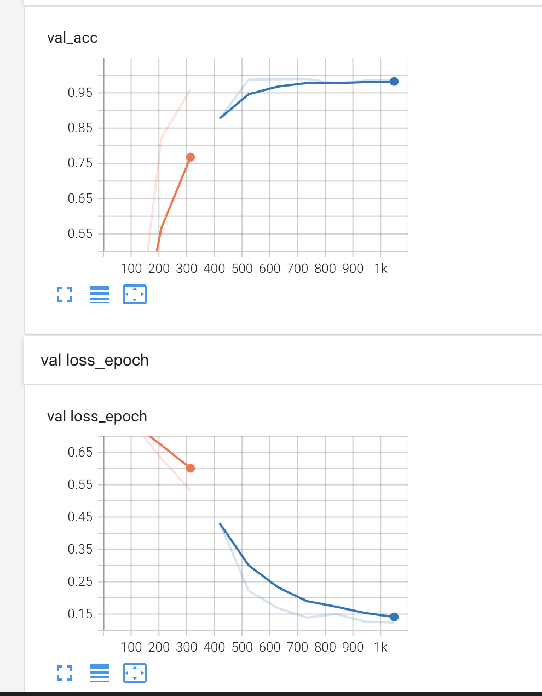
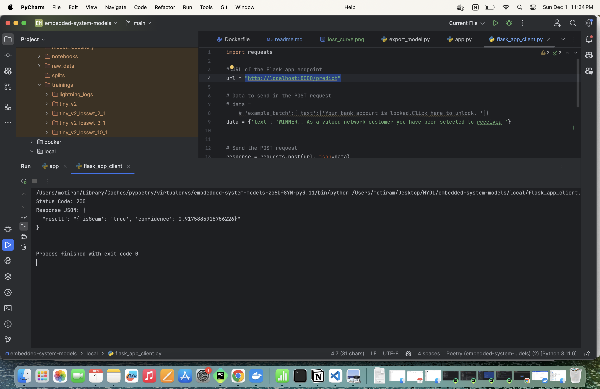

### Welcome to scam detector repo

This repo have action setup to image is pushed to dockerhub. 

# run prebuild docker image To run same
1. `docker pull mbaadror/embedded-system-models:latest`
2. `docker run --rm -it  -p 8000:8000 -t mbaadror/embedded-system-models:latest`
3. send post request to url :`http://localhost:8000/predict` with  `data = {'text': 'WINNER!! As a valued network customer you have been selected to receivea '}`
4. or request can be send using the script `./local/flask_app_client.py`

#### How to setup locally
1. to create docker image locally `bash | ./local/docker_commands/build_image.sh`
2. run docker image `bash | ./local/docker_commands/run_image.sh`

#### Results
###### Loss and Accuracy Curve 

###### Sample Result 

##### Key Points 
1. Spam detection data used in this is quite imbalanced dataset so, model is trained using 
high weight to the spam class [ 10,1] to achieve a good accuracy 
2. Current model is 4.4 million params size is a lightweight model 
3. Model is exported to `onnx` for lightweight deployment
4. CI/CD actions are setup in this repo to smoothen the process of deployment 
5. Docker image is already precompiled at the dockerhub with the model inside this, since model
is small in size [1.5mb]
6. Tokenizer itself have the truncation part implemented in this which help do preprocessing 

